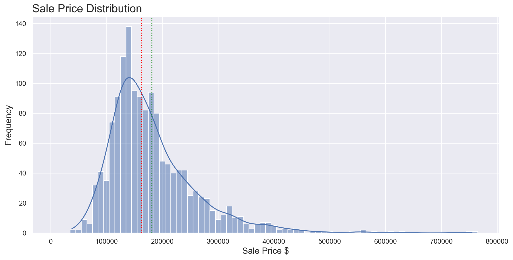
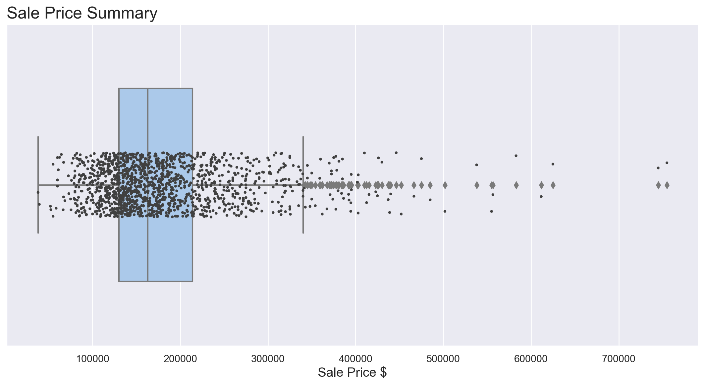
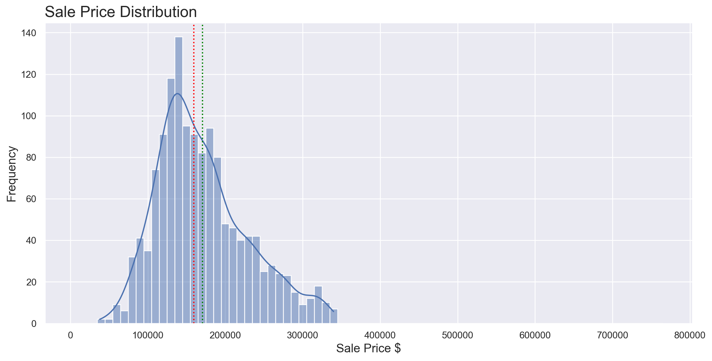
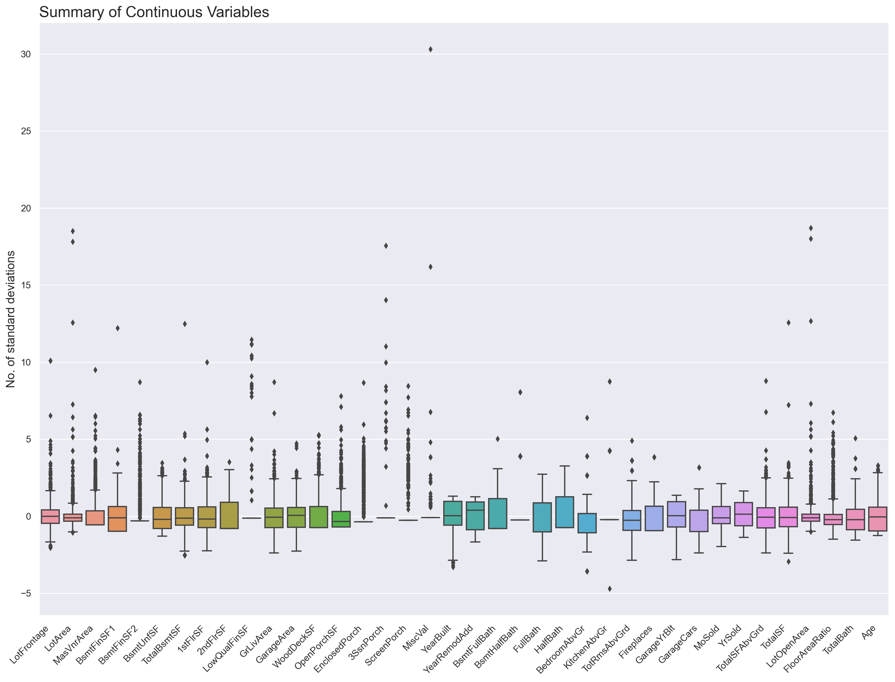
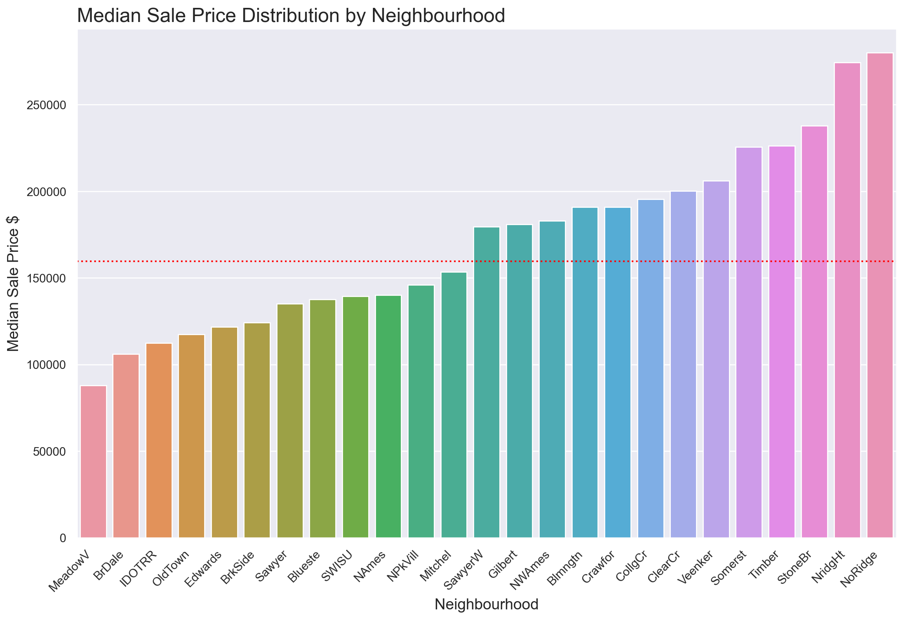
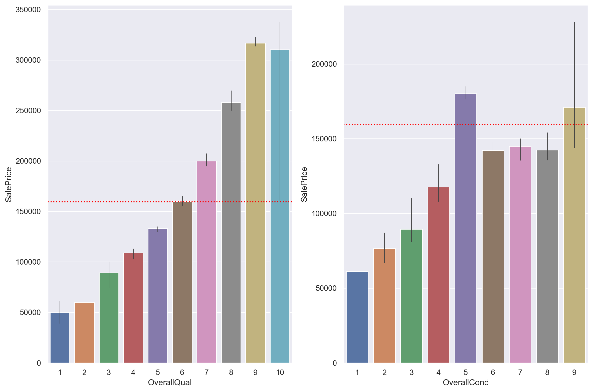
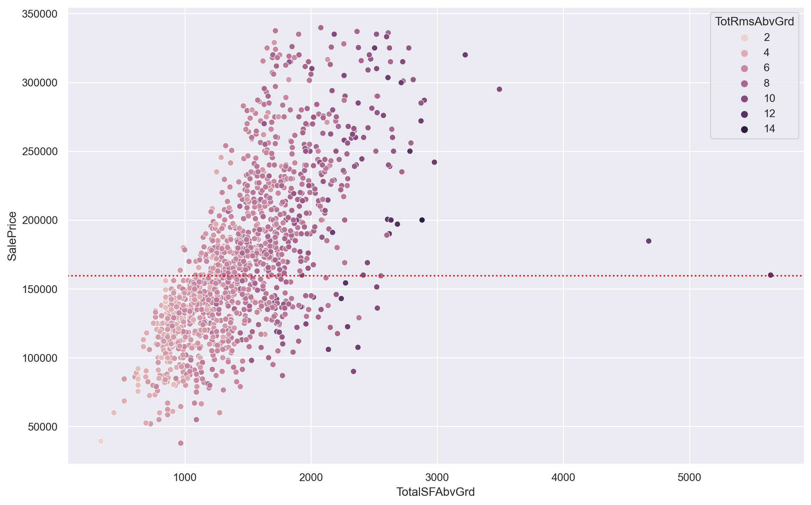
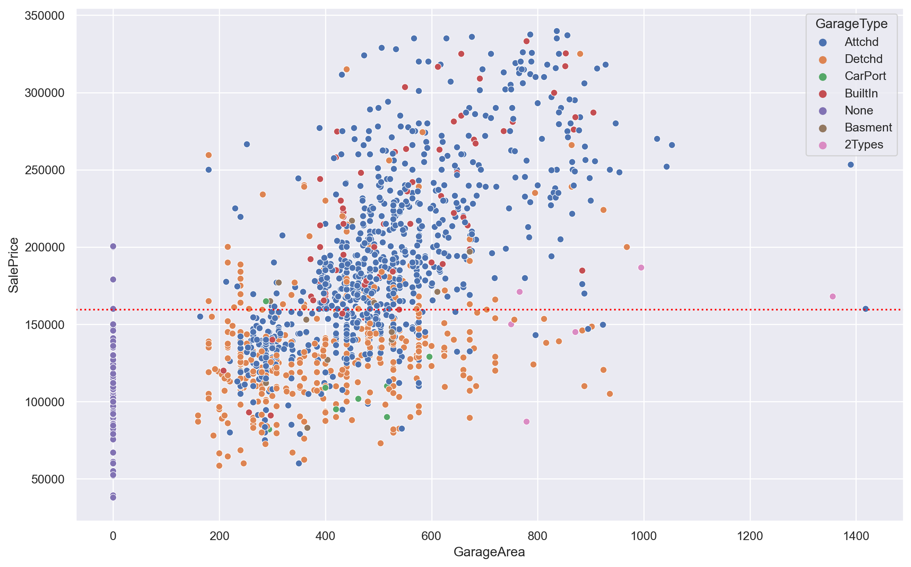

# Web Scraping and Salary Prediction

## Overview

This project was completed as the third project of my Data Science Immersive bootcamp at General Assembly in London.  
This document explains the background, the objectives, the methodologies, the conclusions and the tools used.  

  

## Table of Contents

[Background](#Background)  
[Objectives](#Objectives)   
[Data Collection](#Data-Collection)  
[Data Cleaning & Processing](#Data-Cleaning-&-Processing)  
[Exploratory Data Analysis](#Exploratory-Data-Analysis)  
[Modelling](#Modelling)  
[Limitations](#Limitations)  
[Conclusion](#Conclusion)  
[Future Work](#Future-Work)  
[Libraries Used](#Libraries-Used)  
[Contact](#Contact)  

  

## Background

The application of data science techniques to the built environment could unlock extremely interesting opportunities in the real estate industry, improving the efficiency of companies operating in a traditionally 'old school' sector.  
By focusing on the residential segment, a model that reliably predicts house prices based on fixed or variable characteristics can be a powerful tool for real estate professionals, landlords and homebuyers.  

The business case for the project is a new "full stack" real estate company interested in using data science to determine the best properties to buy and re-sell, whose strategy is two-fold:
* Own the entire process from the purchase of the land all the way to sale of the house, and anything in between.
* Use statistical analysis to optimize investment and maximize return.

This imaginary company is still small, and although investment is substantial the short-term goals of the company are more oriented towards purchasing existing houses and flipping them as opposed to constructing entirely new houses.  

  

## Objectives

The goal of this project is to build different models that can:
1. Estimate house values based on fixed characteristics
2. Estimate house values based on changeable characteristics
3. Estimate house values based on changeable characteristics unexplained by the fixed ones
4. Determine what property features predict an "abnormal" sale

This way, the company can use this information to purchase homes that are likely to sell for more than the purchase cost plus the renovation cost.  

  

## Data Collection

The data used in this project comes from the [Ames Housing dataset](https://www.kaggle.com/c/house-prices-advanced-regression-techniques) made available on Kaggle.  
The dataset contains real estate transactions in the city of Ames, Iowa, from January 2006 to July 2010 and consists of 1,460 properties across 80 characteristics.    

  

## Data Cleaning & Processing

After building a data dictionary that includes description, mutability and variable type for all features, I checked for repetitions in related features and removed non-residential properties and features with very low variability from the dataset.  
As part of feature engineering, I created attributes related to the total area of the property, the lot open area, the floor area ratio, the total number of bathroom and the age of the property.  
All work was done in Python on Jupyter notebooks, and the processing revolved around:

* Identifying variables relevant to modelling, and which ones to drop.
* Exploring opportunities for new feature creation.
* Looking for erroneous or missing data.
* Imputing missing values where possible.
* Performing ordinal encoding where categorical variables where incorrectly designated.
* Creating the target variable.  

The resulting dataset consisted of 1,441 properties across 82 characteristics.  

  

## Exploratory Data Analysis
  
  

Initial EDA showed that sale price has a typical right skewed distribution with the median equals to $163,000.  
The boxplot shows several outliers towards the right end: the minimum sale price is equal to $37,900 while the most expensive property has been sold for $755,000.  

I removed the outliers from the dataset to help normalise the sale price distribution.  
The right tail in the histogram has decreased significantly, and skewness and kurtosis have also been substantially reduced.  
The new median sale price is equal to $159,500 and the mean is equal to $170,516, the minimum has remained unchanged at $37,900 while the most expensive property is equal to $339,750.  

Most continuous variables shows a strong positive skewness, which is not surprising given that the dataset concerns the real estate sector.  
Correlation and multicollinearity have been verified separately for fixed and mutable features.

The most expensive neighbourhoods are Northridge, Northridge Heights and Stone Brook, and the median sale price in the first two exceeds $250,000.  
This figure is more than three times higher than that found in the poorest neighbourhood, Meadow Village.  

Unsurprisingly, there is a clear direct relationship between the overall quality, overall condition, construction year and the sale price of the properties.  

Unsurprisingly, there is a clear direct relationship between the total area above ground, the garage area and the sale price of the properties.  

Before the modelling phase I removed the features among those with greater multicollinearity.  
When addressing feature selection, I also considered the correlation with sale price, precision, internal variability and overlaps between different variables.  

  

## Modelling

I defined the project as a classification problem using the median salary as the splitting point: the baseline accuracy was therefore 0.50, reflecting a perfectly balanced class distribution.  
I defined four sets of models based on different predictors, each with three models to run: Logistic Regression, Decision Tree with GridSearchCV and Random Forest with GridSearchCV.  

The first set of models only used the company state as a factor in predicting whether a job listing had a low salary (defined as below the median salary of all jobs) or a high salary (above the median). Among these models the best were the Logistic Regression and the Decision Tree which achieved a CV score of 0.5693.  

In the second set of models I incorporated additional features, using a set of functions designed to extract information from the job title. The work arrangement was also added on the assumption that, unless explicitly stated, the position was on-site.
Among the three models implemented, the best was the Random Forest which achieved a CV score of 0.7486, a significant improvement compared to previous models that were based only on location.  

Instead of using a limited set of functions to extract information, I enhanced the initial models by implementing NLP (Natural Language Processing) techniques. Specifically, I used CountVectorizer on the third set and TfidfVectorizer on the fourth and final set of models to extract features from the job title.  

In the third set the best model was the Random Forest which achieved a CV score of 0.8318, once again a significant improvement compared to the previous models that used a defined number of features.  
In the last set of models Random Forest achieved a CV score of 0.8386, the highest among all models.  
Both sets observed similar results and performed significantly better than the previous one, and the best model was the Random Forest in the fourth set with a considerable improvement (+0.34) over the baseline of 0.50.  

The best model achieved an accuracy of 84%, a marked improvement from the 50% accuracy of random selection, however this still resulted in incorrect predictions in 16% of cases.  
In this scenario, it would be better to falsely predict that someone will earn less than median when in reality they will earn more, so even if the prediction is wrong, they may be happily surprised to earn more than expected.  
To change our model's predictions so that we do not incorrectly tell someone they will earn more than the median, we had to raise the threshold for predicting a high salary.  
We set the threshold to 85% to reduce the number of false positives, even though this slightly decreased the model's accuracy.  
The model achieved a precision of 96% for high salaries, but it was clearly overpredicting low salaries.  

  

## Limitations

The main limitations of this project arise from the fact that it uses averaged salaries from ranges, which can be quite broad. It would be interesting to compare the performance of the model with precise salaries to see how much of an impact this has.  
Another limitation of the dataset, directly related to Indeed.com, is that it did not include any information about the company size, sector, and revenue.  
Additional work could be aimed at extracting relevant information, especially about the job responsibilities, from the job description using NLP techniques.  

  

## Conclusion

The nature of this project was primarily exploratory, so no hypothesis were made about which factor might have the greatest impact on data-related job salaries.  

The latest Random Forest model using GridSearchCV (which implemented TfidfVectorizer to extract features) achieved an accuracy score of 0.8379 and a CV score of 0.8386.  
The model was balanced between the two classes, had a good accuracy and indeed a very good class separation capacity.  

The most prominent features for this model were the job titles containing engineer, senior and the remote work arrangement, meaning that engineering-related jobs and higher-level positions had the greatest impact in predicting job salaries.  

  

## Future Work

To further improve the current work, the following steps should be taken:
* Feature Engineering, with the creation of additional features such as company sector, company longevity and job responsibilities.
* Using more precise location tags than the company state, possibly by extracting the ZIP code
* Imputing values where missing, to avoid the removal of entire observations.
* Removing outliers, after further analysis and due diligence of the plausible values.
* Employing Gradient Boosting, XGBoost and ensemble methods, checking the effects on the model's performance.  

  

## Libraries Used

* Pandas
* NumPy
* SciPy
* Matplotlib
* Seaborn
* Scikit-Learn  
* XGBoost  
* Imbalanced-Learn

  

## Contact
Interested in discussing my project further?  
Please feel free to contact me on [LinkedIn](https://www.linkedin.com/in/fedfioravanti/).  

  
